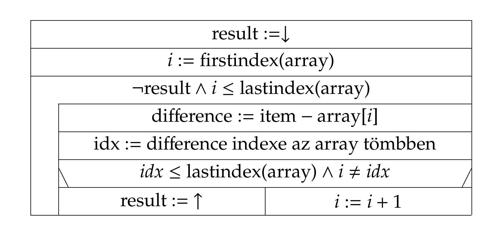

# Alapfeladat (12 pont)
Készítsen `SumOfTwoInts()` néven függvényt, amely előjeles egészeket tartalmazó tömböt és egy előjeles egész számot fogad paraméterként. A függvény döntse el, hogy a tömbben van-e két olyan egész szám, amelyek összege a paraméterként kapott egész szám (a hatékonyság most nem szempont).

Például, a `{2, 5, -7, 6, 9}` tömb esetén a 7 felírható a 2 és 5 tömbbeli számok összegeként, és -2 felírható az 5 és -7 számok összegeként; ezekben az esetekben a visszatérési érték 1. A 12 nem írható fel bármely tömbbeli két egész összegeként, ilyenkor a visszatérési érték 0.

A `SumOfTwoInts` függvény struktogramja:

Az `idx := difference indexe az array tömbben` értékadáshoz írjon egy `indexof` nevű segédfüggvényt, amely paraméterként egy egész számokat tartalmazó tömböt és egy egész számot fogad. Ha az egész szám megtalálható a tömbben, térjen vissza a tömbbeli indexével, máskülönben a kapott tömb utolsó érvényes indexétől eggyel nagyobb számmal.

Készítsen főprogramot, amely a fenti példákkal leteszteli az elkészített függvényt. (Nem kell sem billentyűzetről olvasni, sem a parancssori argumentumokat feldolgozni: egy "beégetett" tömbbel megoldhatjuk a feladatot.) A főprogram írja ki a különböző esetekre, hogy a megadott 7, -2 és 12 értékek felírhatók-e bármelyik két tömbbeli elem összegeként (igen/nem válasz).
# Modularizálás (5 pont)
Bontsa fordítási egységekre programját. A főprogram kerüljön az egyik, a `SumOfTwoInts` függvény kerüljön a másik fordítási egységbe. A kettő kapcsolatát egy header állomány biztosítsa. A header állományt védje include guard. Gondoskodjon arról, hogy az `indexof` segédfüggvény csak a saját fordítási egységében legyen meghívható!
# Pozíciók (3 pont)
Módosítsa a `SumOfTwoInts()` függvényt úgy, hogy az paraméterben juttassa vissza a hívóhoz azon két tömbbeli elem indexét, amelyek összegeként a keresett érték felírható. Módosítsa a főprogramot úgy, hogy kiírja a képernyőre az esetlegesen megtalált elemek tömbbeli indexeit és az elemeket is.
# Főprogram (10 pont)
Módosítsa a főprogramot úgy, hogy a program parancssori paramétereit dolgozza fel. A programot a következő három paraméterrel lehessen használni:
```
item N item1:item2:...:itemN
```
Az első paraméter az egész szám, amelynek az összeg-felbontását keressük. A második paraméter a tömb mérete, majd utána N darab **nem negatív** egész szám (a tömb elemei) kettősponttal elválasztva. Például `7 5 2:5:13:22:1` lehet egy paraméterezés. Ellenőrizze, hogy a program megfelelő számú paraméterrel lett-e meghívva: ha nem, 1-es exitkóddal termináljon a program.

Az `item1:item2:...:itemN` alakú sztringet feldolgozhatjuk például a `string.h` függvénykönyvtár `strtok()` függvényével (de nem kötelezõ ezzel; karakterenként feldolgozva is kiolvashatja a sztringbõl az N darab egész számot). A sztring -> int konverzióra használhatja az `stdlib.h` függvénykönyvtár `atoi()` függvényét is.

Tárolja a heapen a sztringből kiolvasott N db egész számot, majd hívja meg ezen adatokra a `SumOfTwoInts()` függvényt. Ha a memóriafoglalás sikertelen volt, a program 1-es exitkóddal termináljon. A dinamikus tömb használata után szabadítsa fel a memóriaterületet.
